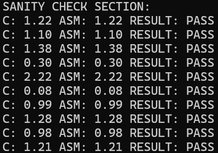
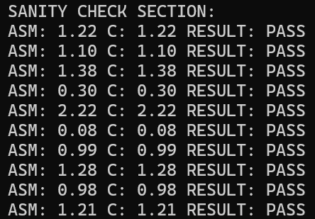
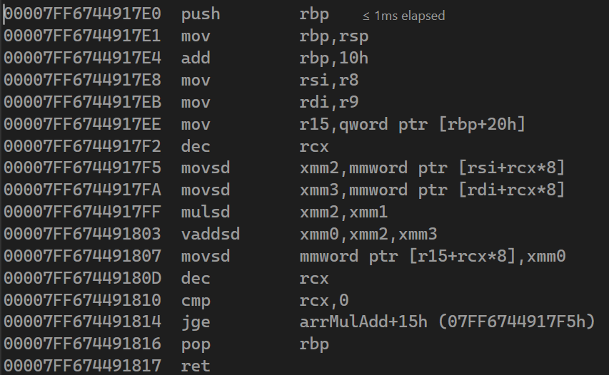
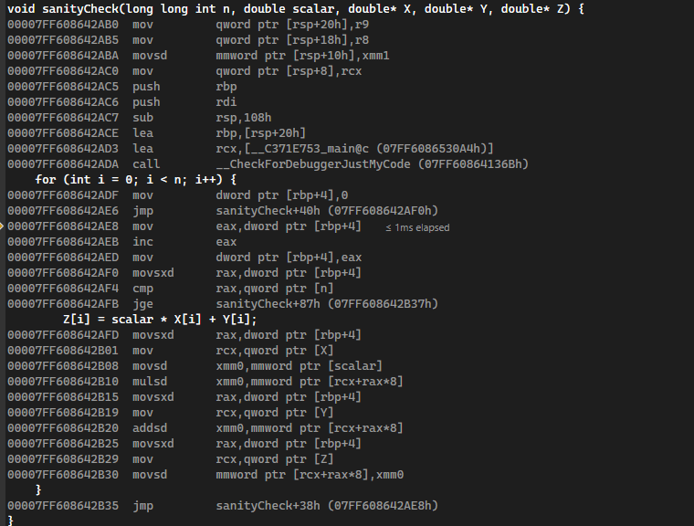
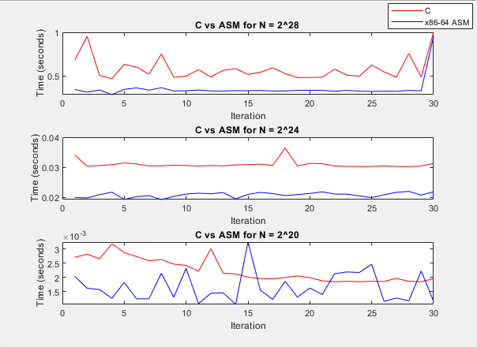

# LBYARCH MP#2 - DAXPY(A*X+Y)

By: Ambrosio, Carlos Felipe Q. S13
    Ambrosio, Lorenzo Aivin F. S13

Write the kernel in (1) C program and (2) an x86-64 assembly language.  The kernel is to perform DAXPY (A*X + Y) function.

**Input**: Scalar variable n (integer) contains the length of the vector;  Scalar variable A is a double-precision float. Vectors X, Y and Z are double-precision float.

***Required to use functional scalar SIMD registers**

***Required to use functional scalar SIMD floating-point instructions**

Process:  Z[i] = A*X[i] + Y[i]
Example:

A --> 2.0

x -> 1.0, 2.0, 3.0

y -> 11.0, 12.0, 13.0

(answer) z--> 13.0, 16.0, 19.0

**Output**: store result in vector Z.  Display the result of 1st ten elements of vector Z for all versions of kernel (i.e., C and x86-64).

## Analysis of Execution Time and Code Output

Before anything else, the first thing to check is whether or not the kernels have the same output, this was done by comparing the results of the first 10 elements of the vectors like so:

| x86-64 | C    | Result |
| -------- | ------ | :------- |
| 1.22   | 1.22 | PASS   |
| 1.10   | 1.10 | PASS   |
| 1.38   | 1.38 | PASS   |
| 0.30   | 0.30 | PASS   |
| 2.22   | 2.22 | PASS   |
| 0.08   | 0.08 | PASS   |
| 0.99   | 0.99 | PASS   |
| 1.28   | 1.28 | PASS   |
| 0.98   | 0.98 | PASS   |
| 1.21   | 1.21 | PASS   |
|        |      | PASS   |

| x86-64 to C                        | C to x86-64                        |
| ------------------------------------ | ------------------------------------ |
|  |  |

| x86-64               | C                  |
| ---------------------- | -------------------- |
|  |  |

As can be seen from the above output, the kernel in C is 29 instructions long, while the kernel in x86-64 is only 17 instructions long. Observing the average execution time, we can see the difference this makes:

| Length of Vector N (log2) | Average C (seconds) | Average x86-64 (seconds) |
| :-------------------------- | :-------------------- | -------------------------- |
| 28                        | 0.581324            | 0.351511                 |
| 24                        | 0.030980            | 0.020873                 |
| 20                        | 0.002240            | 0.001655                 |

We can also check the graph for each iteration and vector length.

From the above results, we can conclude that the x86-64 ASM is generally faster than the compiled C code. This is because of the fewer instructions required for the assembly code, with it only taking 37 bytes worth of instructions, while the C code took 128 bytes worth of instructions.
